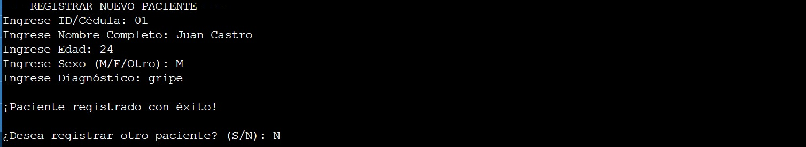
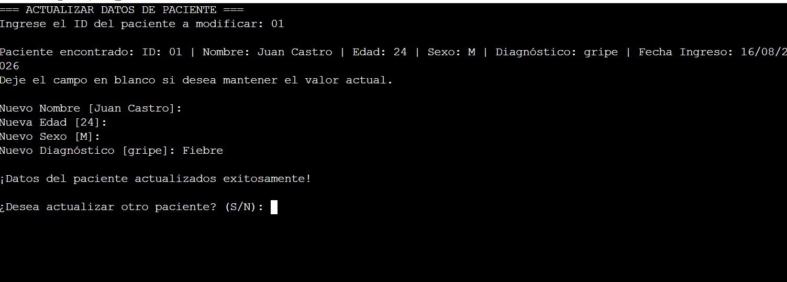
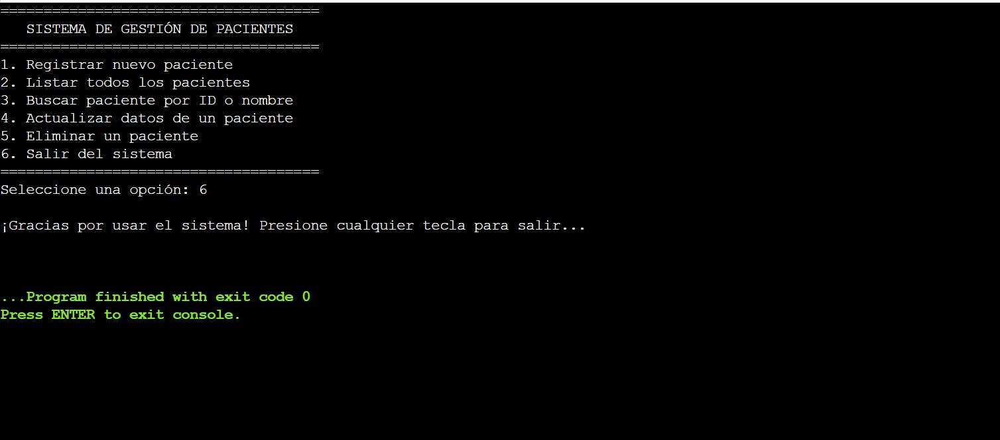
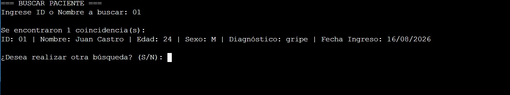
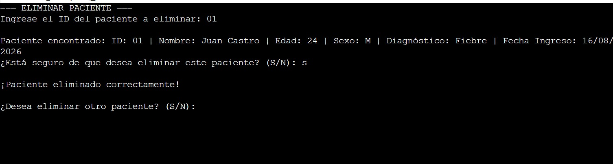

# Gestor-de-Pacientes

Nombre: Dayerin Bernard
Matricula:  25-SISN-2-015

Nombre: Jesus David Calderon
Matricula:  25-SISN-2-024

Descripción del proyecto

El proyecto consiste en desarrollar un sistema de consola en C# para gestionar la información de pacientes de un centro de salud.

El programa permite registrar, consultar, buscar, actualizar y eliminar pacientes utilizando una lista dinámica List<Paciente> como almacenamiento temporal de los datos durante la ejecución del programa.

El sistema está desarrollado utilizando programación orientada a objetos, separando la información de los pacientes de las operaciones de gestión.

Datos de entrada 

Identificador único (ID / Cédula)
Nombre completo
Edad
Sexo (ej. M, F, Otro)
Diagnóstico
Opciones del menú y respuestas de confirmación (1 al 6) respuestas afirmativas o negativas (S/N) 

Datos que procesa 

Validación de unicidad de ID: Comprobación en la lista para evitar el registro de identificadores duplicados.
Validación de tipos de datos: Control de errores al capturar campos numéricos como la edad.
Filtros de búsqueda: Búsqueda y filtrado de coincidencias sobre la lista dinámica evaluando si el criterio coincide con el ID o el nombre completo.
Actualización selectiva: Modificación condicional de las propiedades del objeto paciente localizado en memoria.
Eliminación con confirmación: Localización del registro objetivo y eliminación física dentro de la lista List<T> tras validar la decisión del usuario.

Datos de salida 

Listado de pacientes: Presentación formateada en consola con los campos del paciente, incluyendo la fecha y hora de ingreso generada por el sistema.  Resultados de búsqueda: Confirmación del número de coincidencias halladas y su despliegue en pantalla.  Mensajes de confirmación: Notificaciones de éxito tras registrar, actualizar o eliminar un paciente.  Mensajes de error y advertencia: Alertas visuales ante datos vacíos, IDs duplicados, edades no válidas o registros no encontrados. 

Capturas

